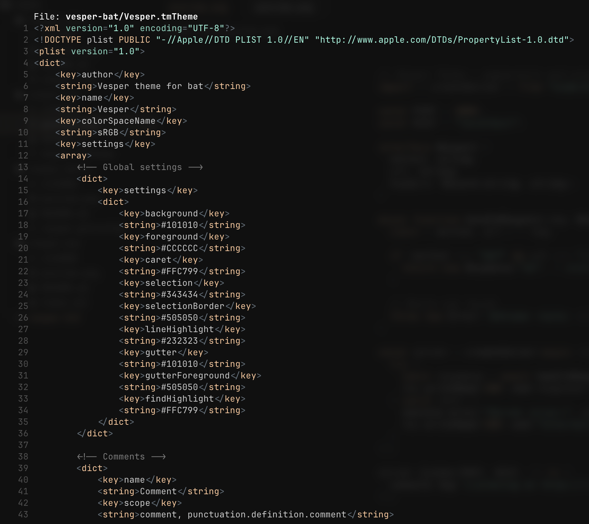
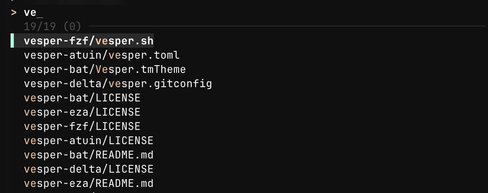
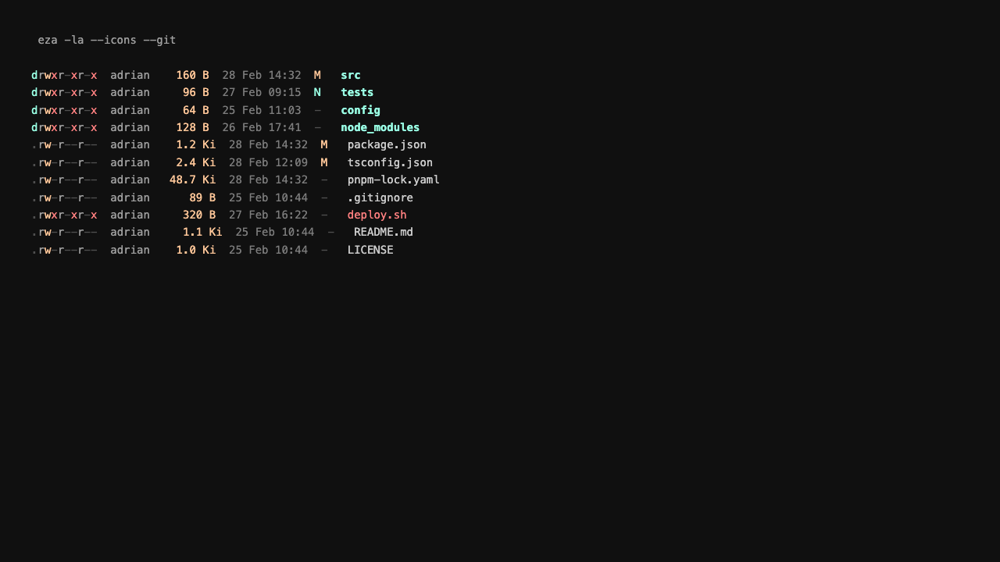
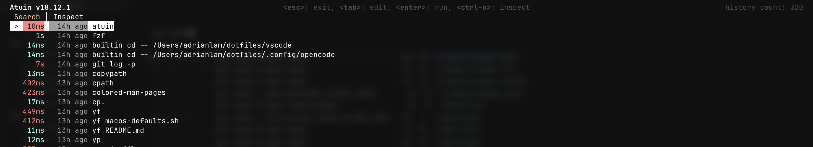

# Vesper Themes

Community ports of the [Vesper](https://github.com/raunofreiberg/vesper) dark theme by [Rauno Freiberg](https://github.com/raunofreiberg) for terminal tools.

Peppermint and orange flavored.

## Ports

| Tool | Repository |
| ---- | ---------- |
| [bat](https://github.com/sharkdp/bat) | [vesper-bat](https://github.com/adriandlam/vesper-bat) |
| [fzf](https://github.com/junegunn/fzf) | [vesper-fzf](https://github.com/adriandlam/vesper-fzf) |
| [eza](https://github.com/eza-community/eza) | [vesper-eza](https://github.com/adriandlam/vesper-eza) |
| [atuin](https://github.com/atuinsh/atuin) | [vesper-atuin](https://github.com/adriandlam/vesper-atuin) |

## bat

TextMate theme (`.tmTheme`) for bat and Sublime Text.



And with fzf:


```sh
# Copy theme and rebuild cache
cp Vesper.tmTheme "$(bat --config-dir)/themes/"
bat cache --build

# Use it
bat --theme=Vesper file.txt
```

Or add to your bat config (`bat --config-file`):

```
--theme="Vesper"
```

## fzf

Sourceable `--color` config for fzf.



```sh
# Source it
source /path/to/vesper-fzf/vesper.sh
```

Or copy the `--color` string directly into your `FZF_DEFAULT_OPTS`:

```sh
export FZF_DEFAULT_OPTS="$FZF_DEFAULT_OPTS \
  --color=bg+:#2a2a2a,bg:#101010,spinner:#99ffe4,hl:#ffc799 \
  --color=fg:#ffffff,header:#505050,info:#505050,pointer:#99ffe4 \
  --color=marker:#99ffe4,fg+:#ffffff,prompt:#ffc799,hl+:#ffc799 \
  --color=selected-bg:#2a2a2a,border:#2a2a2a,gutter:#101010"
```

## eza

Full `theme.yml` with file type, permission, and git colors.



```sh
mkdir -p ~/.config/eza
cp theme.yml ~/.config/eza/theme.yml
```

## atuin

Theme TOML for the atuin shell history TUI.



```sh
mkdir -p ~/.config/atuin/themes
cp vesper.toml ~/.config/atuin/themes/vesper.toml
```

Add to `~/.config/atuin/config.toml`:

```toml
[theme]
name = "vesper"
```

## Color Palette

| Role        | Hex       | Preview |
| ----------- | --------- | ------- |
| Background  | `#101010` |  |
| Foreground  | `#CCCCCC` |  |
| Strings     | `#99FFE4` |  |
| Keywords    | `#FFC799` |  |
| Comments    | `#7D7D7D` |  |
| Errors      | `#FF8080` |  |
| Operators   | `#65737E` |  |
| Functions   | `#FFFFFF` |  |

## Credits

Based on the [Vesper](https://github.com/raunofreiberg/vesper) VS Code theme by [Rauno Freiberg](https://github.com/raunofreiberg).

## License

[MIT](LICENSE)
